<div align="center">

# ⚡ Codexa

### AI-Powered GitHub Repository Intelligence Platform

Understand any public GitHub repository in seconds through interactive architecture diagrams, intelligent repository summaries, technology detection, folder explanations, and visual project insights.

---

<p align="center">


</p>

---

<p align="center">


</p>

<p align="center">


</p>

---

### 🌐 Live Demo

codexaa.pages.dev/

### 📖 Documentation

Coming Soon

### ⭐ Give this repository a Star if you like the project.

</div>

---

# 🚀 What is Codexa?

Codexa is an AI-powered GitHub repository analyzer that helps developers understand unfamiliar repositories without manually reading hundreds of source files.

Simply paste any public GitHub repository URL and Codexa automatically analyzes the project structure, detects technologies, explains important folders, generates architectural insights, and presents everything through an interactive visual dashboard.

Instead of spending hours exploring a new codebase, developers can understand how a repository works within seconds.

---

# 🎯 Why Codexa?

Understanding someone else's project is usually difficult because:

- Hundreds of folders
- Unknown project architecture
- Different coding styles
- Complex configurations
- No documentation
- Large file structures

Codexa solves these problems by automatically converting repository structures into easy-to-understand visual explanations.

---

# 💡 What Can Codexa Do?

- 🔍 Analyze Public GitHub Repositories
- 🧠 Generate Intelligent Repository Summaries
- 📂 Explain Folder Structure
- ⚛ Detect Frontend & Backend Technologies
- 📦 Detect Package Managers
- 🏗 Visualize Project Architecture
- 📊 Display Repository Statistics
- ⚡ Fast Analysis with Response Caching
- 🎨 Beautiful Interactive Dashboard
- 🌙 Responsive User Interface

---

# 👥 Who is this for?

👨‍💻 Developers

🎓 Students

🚀 Open Source Contributors

💼 Recruiters

📚 Self Learners

🏢 Engineering Teams

---

# 🧭 Navigation

- Overview
- Features
- Screenshots
- Demo
- Architecture
- Analysis Pipeline
- Technology Stack
- Folder Structure
- API Documentation
- Installation
- Environment Variables
- Database Setup
- Usage
- Future Roadmap
- Contributing
- License

---

# 🌟 Highlights

| Feature | Description |
|----------|-------------|
| ⚡ Fast Repository Analysis | Analyze repositories in seconds |
| 🧠 Smart Understanding | AI-powered repository explanation |
| 📂 Interactive Explorer | Explore folders visually |
| 📊 Rich Dashboard | Repository insights and statistics |
| 🎨 Beautiful Interface | Modern responsive UI |
| ⚛ Automatic Detection | Framework & language detection |
| 🗂 Folder Intelligence | Understand folder purpose instantly |
| 🚀 Optimized Performance | Faster repeated analyses |

---
---

# ✨ Core Features

Codexa transforms complex GitHub repositories into beautiful visual explanations.

Instead of reading hundreds of source files, simply paste a repository URL and let Codexa explain everything.

---

## 🚀 Feature Overview

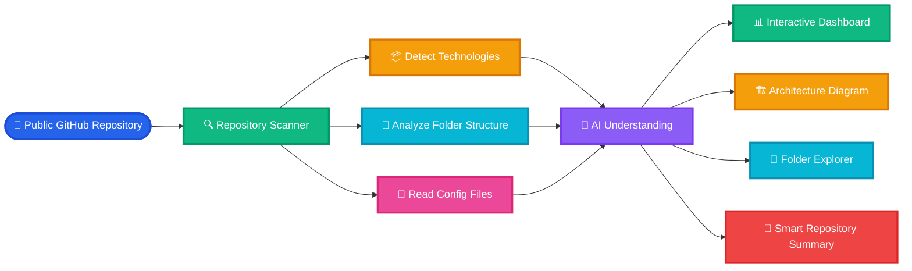

---

# ⚡ Everything Codexa Understands

| Category | Capabilities |
|-----------|--------------|
| 📂 Repository | Complete Project Analysis |
| 📁 Folder Structure | Folder Purpose Detection |
| ⚛ Framework | React, Next.js, Vue, Angular, Express and more |
| 📦 Package Manager | npm, pnpm, yarn |
| 📄 Configuration | package.json, tsconfig, vite.config etc. |
| 📊 Statistics | Repository Metadata |
| 🏗 Architecture | Project Structure Visualization |
| 💬 AI Summary | Human Friendly Explanation |

---

# 🎯 Repository Analysis Journey

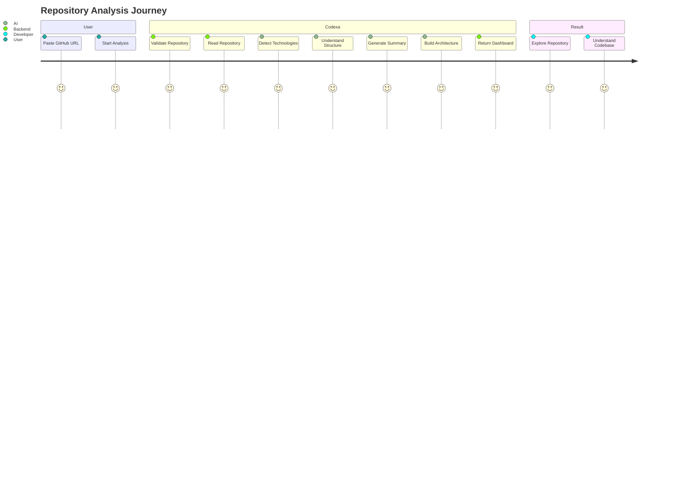

---

# 🧠 Intelligent Analysis Engine

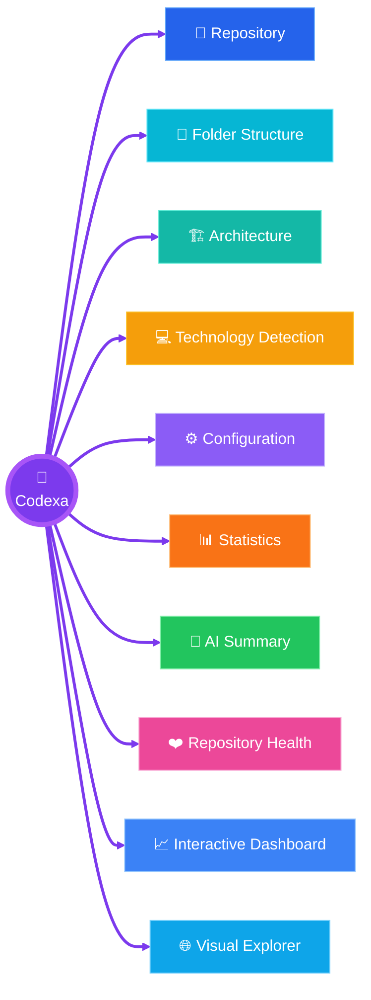

---

# 🔥 What Makes Codexa Different?

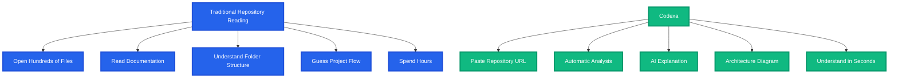

---

# 🌟 Feature Highlights

## 🔍 Intelligent Repository Analysis

Automatically scans public GitHub repositories and understands the complete project structure.

---

## 🧠 Smart Repository Summary

Generate easy-to-read explanations that help developers understand unfamiliar projects quickly.

---

## 📂 Folder Intelligence

Every important folder is explained with its purpose and responsibility.

---

## ⚛ Technology Detection

Automatically detects frontend frameworks, backend technologies, languages, configuration files, and package managers.

---

## 🏗 Interactive Architecture

Transforms repository structure into visual diagrams for faster understanding.

---

## 📊 Interactive Dashboard

Beautiful dashboard presenting repository information in a clean and organized way.

---

## 📱 Modern Interface

Responsive interface designed for desktop, tablet, and mobile devices.

---

# 🏛️ System Architecture

Codexa follows a modular architecture where every layer has a dedicated responsibility.

The frontend communicates with the backend API, which retrieves repository data from GitHub, processes it through the analysis engine, checks the cache, and stores analysis results for faster future access.

---

## 🌈 High-Level Architecture

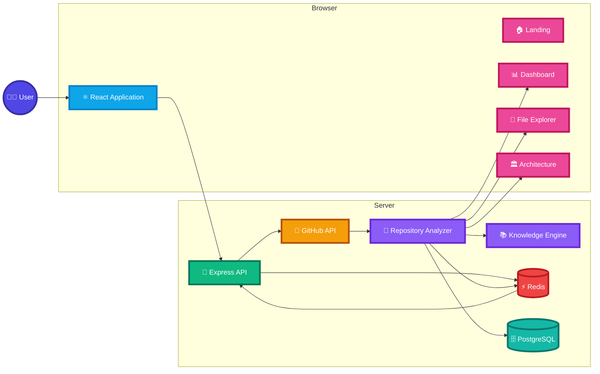

---

# 🔄 Complete Analysis Pipeline

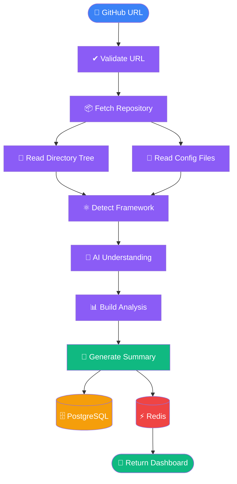

---

# 🧠 Repository Intelligence Engine

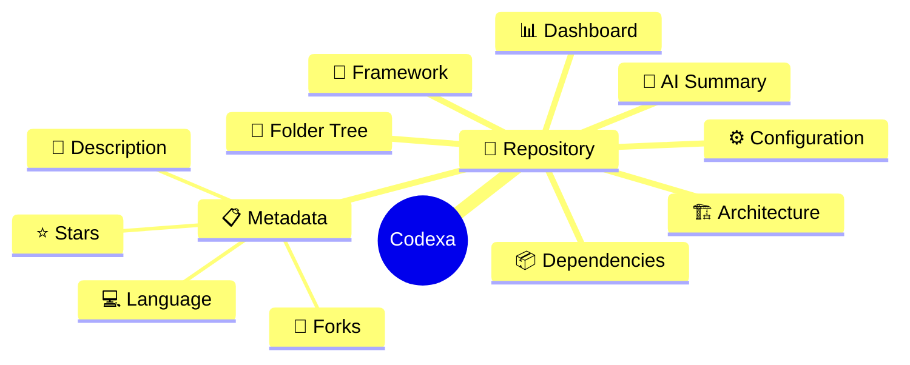

---

# 📡 Request Lifecycle

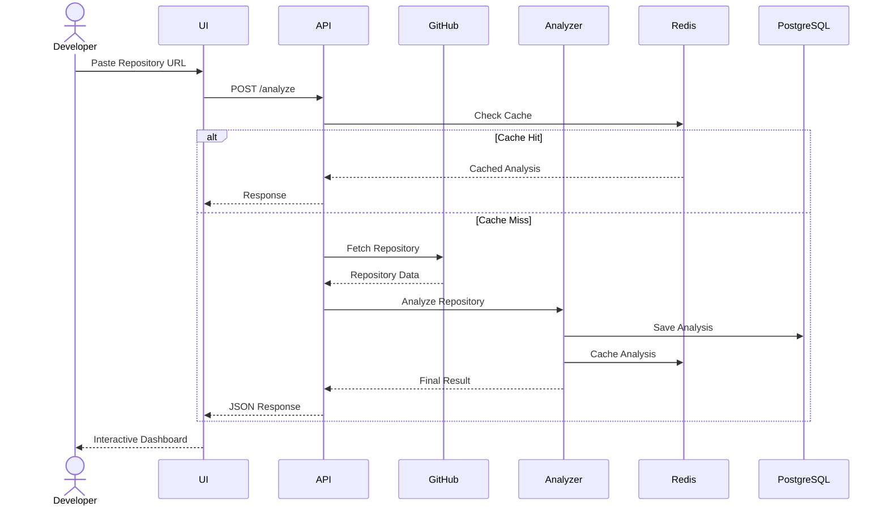

---
---

# 📂 Project Structure

The project is organized into two major applications:

- **Frontend** – Responsible for the user interface and visualization.
- **Backend** – Responsible for repository analysis, technology detection, caching, and data persistence.

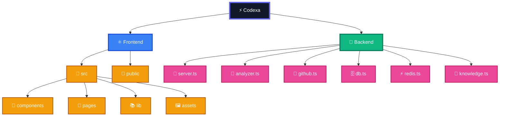

---

# 🏗 Frontend Architecture

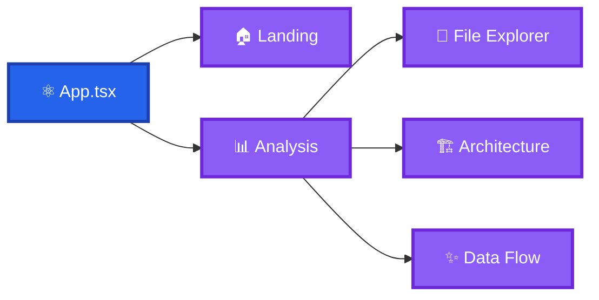

---

# 🚀 Backend Modules

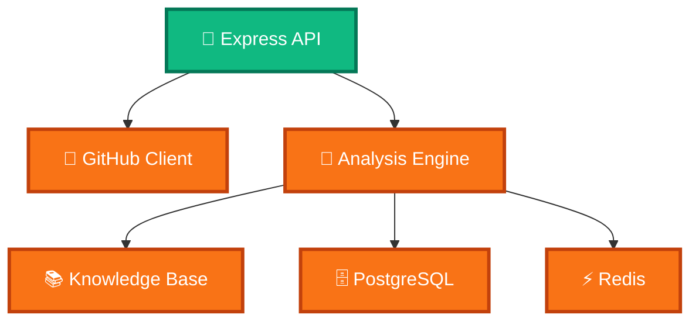

---

# 🔄 Component Communication

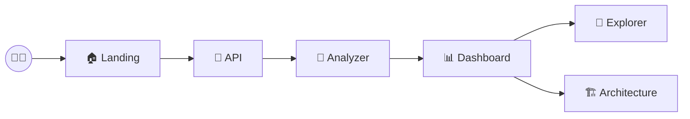

---

# 🧠 Repository Understanding Flow

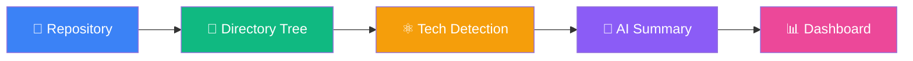

---

# 📁 Folder Responsibilities

| Folder | Purpose |
|---------|----------|
| 📁 frontend | User Interface |
| 📁 backend | Repository Analysis APIs |
| 📁 components | Reusable UI Components |
| 📁 pages | Main Application Views |
| 📁 lib | Utility Functions |
| 📁 assets | Images & Icons |
| 📄 analyzer.ts | Repository Intelligence |
| 📄 github.ts | GitHub API Integration |
| 📄 knowledge.ts | Folder Explanation Engine |
| 📄 db.ts | PostgreSQL Connection |
| 📄 redis.ts | Cache Layer |
| 📄 server.ts | API Entry Point |

---

# 🎯 Design Principles

- 🧩 Modular Architecture
- ⚡ Fast Response Time
- 📦 Clean Folder Structure
- 🎨 Interactive UI
- 📊 Visual Repository Insights
- 🧠 AI-Assisted Understanding
- 🔄 Reusable Components
- 📱 Responsive Experience

---
---

# ⚙️ Internal Processing Engine

The entire analysis process is divided into multiple intelligent stages.

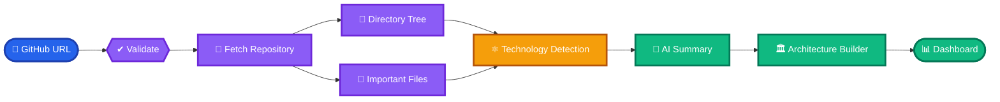

---

# 🌐 Complete API Flow

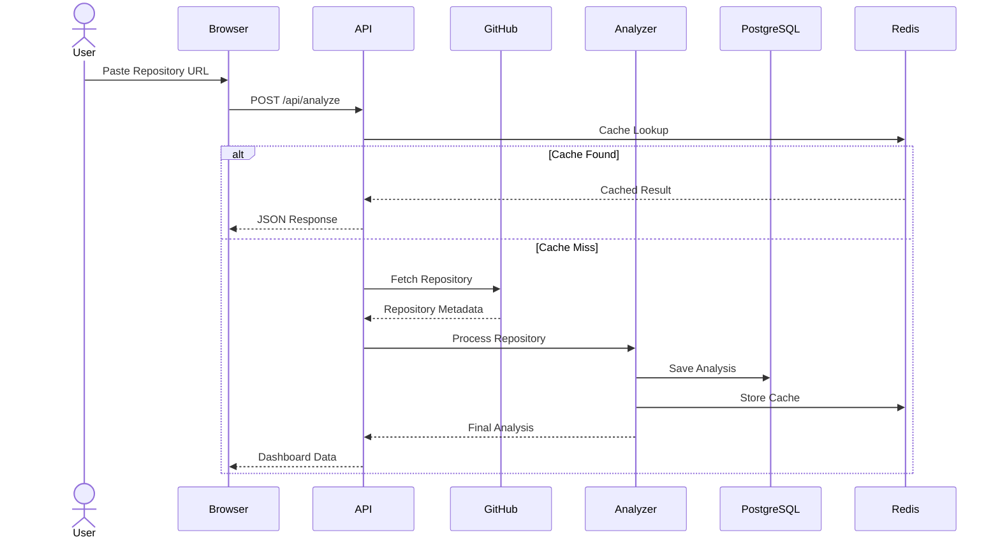

---

# 🗄 Database Relationship

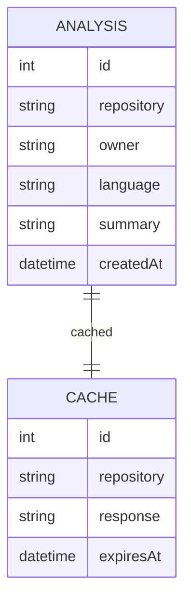

---

# ⚡ Cache Strategy

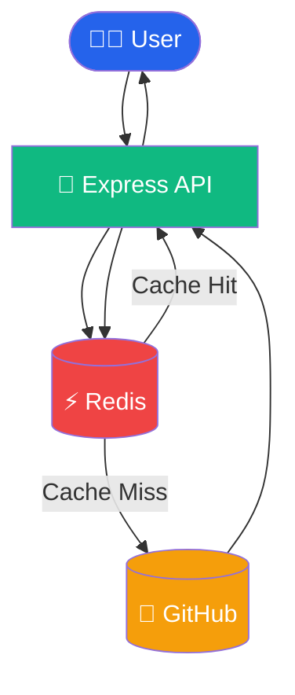

---

# 🧠 Technology Detection Engine

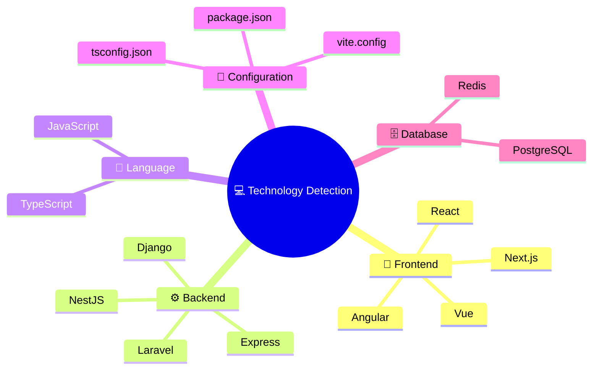

---

# 🧩 Folder Intelligence

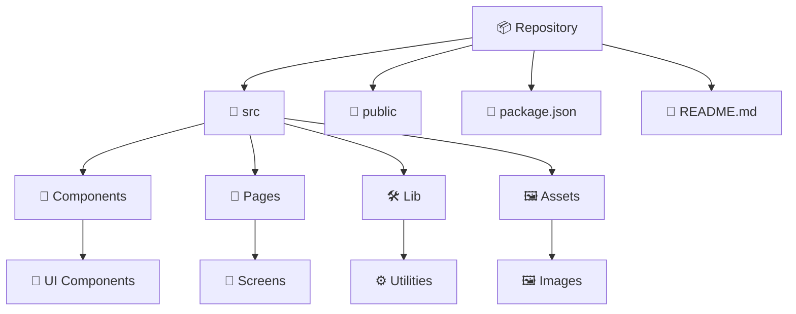

---

# 📡 API Endpoints

| Method | Endpoint | Purpose |
|---------|----------|---------|
| GET | `/api/health` | Health Check |
| GET | `/api/recent` | Recent Analyses |
| POST | `/api/analyze` | Analyze Repository |

---

# 🎯 Processing Stages

| Stage | Description |
|--------|-------------|
| 1 | Validate Repository URL |
| 2 | Fetch Repository Metadata |
| 3 | Read Directory Structure |
| 4 | Detect Technologies |
| 5 | Analyze Important Files |
| 6 | Generate Repository Summary |
| 7 | Build Architecture View |
| 8 | Store Analysis |
| 9 | Return Dashboard |

---
---

## ⚡ Fast Experience

Frequently analyzed repositories are served quickly using response caching.

---
---

# 🧠 Repository Intelligence Engine

Codexa doesn't just fetch repository information.

It intelligently understands how a project is organized, identifies technologies, interprets folder responsibilities, analyzes configuration files, and transforms everything into an easy-to-understand visual experience.

---

# 🏛 Repository Intelligence Pipeline


---

# 🔍 Repository Analysis Layers

```mermaid

flowchart TB

subgraph Layer1["🌍 Input Layer"]

A[GitHub Repository URL]

end

subgraph Layer2["📦 Repository Layer"]

B[Repository Metadata]

C[Repository Tree]

D[Repository Files]

end

subgraph Layer3["🧠 Intelligence Layer"]

E[Technology Detection]

F[Folder Understanding]

G[Configuration Analysis]

end

subgraph Layer4["🎨 Presentation Layer"]

H[Repository Summary]

I[Architecture View]

J[Dashboard]

end

A --> B

B --> C

C --> D

D --> E

D --> F

D --> G

E --> H

F --> I

G --> J

```

---

# 📦 Technology Detection

```mermaid
mindmap
  root((Codexa))
    Frontend
      React
      Next.js
      Vue
      Angular
    Backend
      Express
      Node.js
    Language
      TypeScript
      JavaScript
    Configuration
      package.json
      tsconfig.json
      vite.config.ts
      tailwind.config.js
    Database
      PostgreSQL
      Redis
```

---

# 🌳 Folder Intelligence

```mermaid

graph TD

Repository

Repository --> frontend

Repository --> backend

frontend --> src

src --> components

src --> pages

src --> assets

src --> lib

backend --> analyzer

backend --> github

backend --> knowledge

backend --> redis

backend --> db

backend --> server

```

---

# 📡 Repository Understanding Workflow

```mermaid

sequenceDiagram

actor Developer

participant Codexa

participant GitHub

participant Analysis Engine

participant Dashboard

Developer->>Codexa: Paste GitHub URL

Codexa->>GitHub: Read Repository

GitHub-->>Codexa: Repository Data

Codexa->>Analysis Engine: Analyze Project

Analysis Engine-->>Codexa: Repository Intelligence

Codexa-->>Dashboard: Build Interactive UI

Dashboard-->>Developer: Visual Repository Overview

```

---

# 🎯 Analysis Capabilities

| Category | Description |
|----------|-------------|
| 📂 Folder Intelligence | Explains folder responsibilities |
| ⚛ Framework Detection | Detects frontend/backend technologies |
| 📦 Configuration Analysis | Reads important project configuration files |
| 🏗 Architecture Generation | Creates project structure visualization |
| 📝 Repository Summary | Generates simplified project explanation |
| 📊 Interactive Dashboard | Displays repository insights visually |

---

# 🌟 Why This Matters

Instead of spending hours exploring an unfamiliar repository, Codexa helps developers understand the project's structure, technologies, and architecture within seconds.

It reduces onboarding time, improves learning, and makes exploring open-source projects significantly easier.

---

---

# 🖥 Dashboard Experience

Codexa transforms raw repository data into an elegant visual dashboard that makes understanding complex projects simple and intuitive.

Instead of reading hundreds of files, developers get a structured overview of the entire repository in one place.

---

# ✨ Dashboard Overview

```mermaid
flowchart LR

classDef card fill:#2563EB,color:#fff,stroke:#1E40AF,stroke-width:3px
classDef view fill:#10B981,color:#fff,stroke:#047857,stroke-width:3px
classDef info fill:#8B5CF6,color:#fff,stroke:#6D28D9,stroke-width:3px
classDef stats fill:#F97316,color:#fff,stroke:#C2410C,stroke-width:3px
classDef output fill:#EC4899,color:#fff,stroke:#BE185D,stroke-width:3px

Dashboard["🖥 Codexa Dashboard"]

Dashboard --> Overview

Dashboard --> Summary

Dashboard --> Explorer

Dashboard --> Architecture

Dashboard --> Technologies

Dashboard --> Statistics

Dashboard --> Configuration

Dashboard --> Repository

Overview --> Cards

Statistics --> Charts

Architecture --> VisualMap

Explorer --> FolderTree

Summary --> AI

class Dashboard card
class Overview,Summary,Explorer,Architecture view
class Technologies,Configuration info
class Statistics,Repository stats
class Cards,Charts,VisualMap,FolderTree,AI output
```

---

# 📷 Dashboard Preview

> Replace the following images with your own screenshots.

<div align="center">

## 🏠 Landing Page


<br><br>

## 🔍 Repository Analysis


<br><br>

## 📂 File Explorer


<br><br>

## 🏛 Architecture View


<br><br>

## ⚛ Technology Detection


<br><br>

## 📊 Repository Statistics


</div>

---

# 🎨 Dashboard Components

```mermaid
graph TD

Dashboard

Dashboard --> RepositoryCard

Dashboard --> TechStack

Dashboard --> Summary

Dashboard --> FolderExplorer

Dashboard --> ArchitectureDiagram

Dashboard --> Statistics

Dashboard --> Configurations

Dashboard --> ImportantFiles

Dashboard --> RepositoryInsights
```

---

# 📊 Dashboard Widgets

| Widget | Description |
|---------|-------------|
| 🏠 Repository Overview | Basic repository information |
| 🧠 AI Summary | Human-friendly explanation |
| 📂 Folder Explorer | Browse repository folders |
| 🏛 Architecture | Visual project architecture |
| ⚛ Technology Stack | Detected technologies |
| 📊 Statistics | Repository metrics |
| 📄 Configuration | Project config files |
| 📦 Important Files | Key files detected |

---

# 🌈 Dashboard Layout

```text

+────────────────────────────────────────────────────────────+

                 Repository Overview

+────────────────────────────────────────────────────────────+

        Summary          |        Technology Stack

--------------------------------------------------------------

 Folder Explorer         |      Architecture Diagram

--------------------------------------------------------------

 Repository Statistics   |      Configuration Files

--------------------------------------------------------------

 Important Files         |      Repository Insights

+────────────────────────────────────────────────────────────+

```

---

# 📱 Responsive Experience

```mermaid
flowchart LR

Desktop["🖥 Desktop"]

Tablet["💻 Tablet"]

Mobile["📱 Mobile"]

Desktop --> Responsive

Tablet --> Responsive

Mobile --> Responsive

Responsive --> SameExperience["✨ Consistent User Experience"]

classDef blue fill:#2563EB,color:white
classDef green fill:#10B981,color:white

class Desktop,Tablet,Mobile blue
class Responsive,SameExperience green
```

---

# 💡 User Experience

✔ Clean Interface

✔ Smooth Navigation

✔ Responsive Layout

✔ Interactive Repository Explorer

✔ Organized Dashboard

✔ Easy-to-Understand Visualizations

✔ Beginner Friendly

✔ Modern Design

---
---

<div align="center">


# ⚡ Codexa

### Transforming GitHub Repositories into Interactive Intelligence

<p align="center">

Understand repositories faster • Learn architecture visually • Explore projects intelligently

</p>

---

<p align="center">

<a href="https://github.com/YOUR_USERNAME/Codexa">

</a>

<a href="https://github.com/YOUR_USERNAME/Codexa/fork">

</a>

<a href="https://github.com/YOUR_USERNAME/Codexa/issues">

</a>

<a href="https://github.com/YOUR_USERNAME/Codexa/discussions">

</a>

</p>

---

## 🌍 Connect With Me

<p align="center">

<a href="https://github.com/Saurav6200907210">

</a>

<a href="https://www.linkedin.com/in/YOUR_LINKEDIN">

</a>

<a href="mailto:YOUR_EMAIL">

</a>

</p>

---

### 💙 Built with passion for developers worldwide.

### ⭐ If Codexa helped you, consider giving it a Star!

---


</div>
