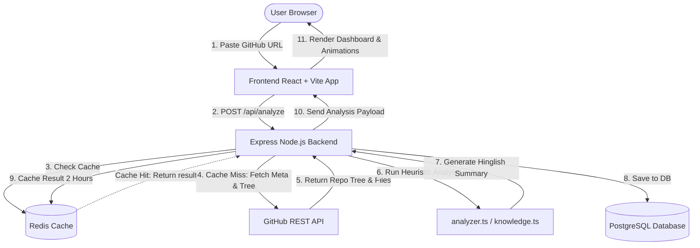

# ⚡ Codexa (Repo Samjho) — Interactive AI Codebase Analyzer

Codexa (also known as **Repo Samjho**) is a beautiful, interactive, AI-powered codebase analysis platform designed to help developers understand public GitHub repositories instantly. By fetching repository trees and analyzing directory structures, dependencies, and configuration files, Codexa generates comprehensive summaries, architectural maps, and interactive file explanations—all written in friendly, easy-to-understand **Hinglish (Hindi + English)**.

---

## 🚀 Key Features

*   🔍 **Instant GitHub Analysis**: Paste any public GitHub URL and get a detailed structural breakdown in seconds.
*   💻 **Interactive File Tree Explorer**: Navigate through files and folders with custom Hinglish descriptions explaining the exact role of every directory.
*   📐 **Visual Architecture Map**: A dynamic interface mapping out the project components, layouts, pages, APIs, and configs.
*   ⚡ **Data Flow Animations**: Canvas-based particle simulations visually representing data flows and communication patterns in the codebase.
*   🔌 **Auto Tech-Stack Detection**: Automatically identifies frameworks (Next.js, React, Remix, Svelte, Vue, Angular, Express, Django, etc.) and toolkits (Tailwind CSS, Drizzle, Prisma, MongoDB, etc.).
*   🏎️ **Double Caching & DB Persistence**: Utilizes Redis for sub-millisecond response caches and PostgreSQL (via Drizzle ORM) to keep track of recent analyses.

---

## 🗺️ System Flow Diagram

Here is how data flows from the user's browser to the backend analysis engine and database:



---

## 🛠️ Technology Stack

| Layer | Technology | Purpose |
| :--- | :--- | :--- |
| **Frontend** | React 18, Vite, TypeScript | Ultra-fast client-side SPA |
| **Styling** | Tailwind CSS, Framer Motion | Fluid layouts and smooth micro-animations |
| **Backend** | Express, TypeScript, TSX | Lightweight API Server |
| **Database** | PostgreSQL | Permanent storage of recent analyses |
| **ORM** | Drizzle ORM | Type-safe queries and schema migrations |
| **Caching** | Redis | Temporary performance caching of analyze results |
| **DevOps** | Docker Compose | Local database setup |

---

## 📁 Repository Directory Structure

```text
Codexa/
├── backend/                  # Express API Backend
│   ├── db.ts                 # Database Connection Setup
│   ├── schema.ts             # Drizzle Schema Definitions
│   ├── github.ts             # GitHub API Integration Client
│   ├── knowledge.ts          # Language map & Hinglish folder purposes
│   ├── analyzer.ts           # Heuristic Analysis Logic
│   ├── redis.ts              # Redis Caching Setup
│   └── server.ts             # Main API Server Entrypoint
│
├── frontend/                 # React Vite Client
│   ├── src/
│   │   ├── components/       # UI Components
│   │   │   ├── LandingPage.tsx       # Search, FAQ, Recent analyses
│   │   │   ├── AnalysisView.tsx      # Main dashboard stats & lists
│   │   │   ├── ArchitecturePage.tsx  # Dynamic component map
│   │   │   └── DataFlowAnimation.tsx # Canvas flow particle system
│   │   ├── lib/              # Frontend Utilities
│   │   └── App.tsx           # Page Routing and State Manager
│
├── docker-compose.yml        # PostgreSQL service container definition
└── package.json              # Main workspace workspace references
```

---

## ⚡ API Endpoints

All endpoints are hosted by default on port `3001` (or custom `PORT` specified in backend configuration):

### 1. `GET /api/health`
Check if the server is up and responsive.
*   **Response**: `{"ok": true}`

### 2. `GET /api/recent`
Fetch the 8 most recently analyzed unique public repositories.
*   **Response**: `{"recent": [{ "id": 1, "fullName": "owner/repo", ... }]}`

### 3. `POST /api/analyze`
Analyze a repository using its public URL.
*   **Request Body**:
    ```json
    { "url": "https://github.com/vercel/next.js" }
    ```
*   **Response**: Returns the complete structured analysis payload containing tech-stack, summaries, and directory metadata.
